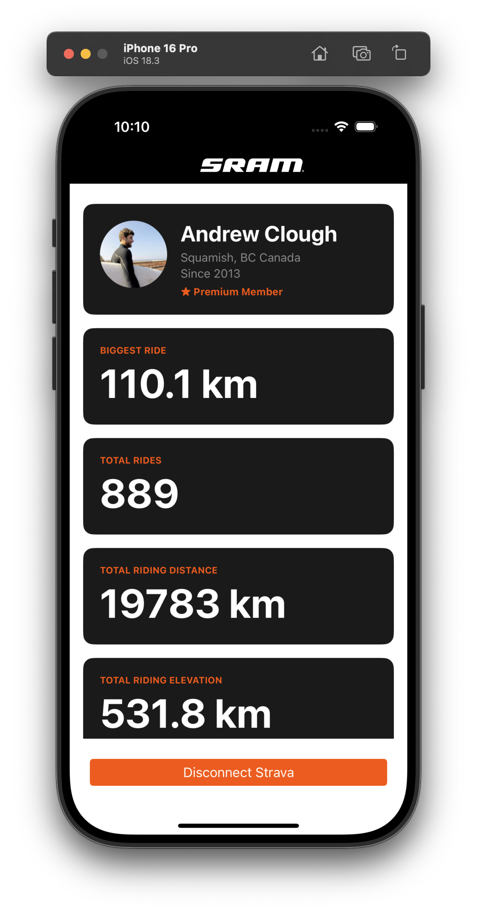

# Strava Profiler App
For when you want to flex on your friends or just admire how much you ride.



## What is this?

A personal iOS app that connects to your Strava account and displays your lifetime cycling stats in one clean view — things like your biggest ride, total distance, total elevation climbed, and hours spent in the saddle.

## How does it work?

1. Open the app and tap **Connect with Strava**
2. Log in with your Strava account and approve access
3. Your stats load automatically — no manual refreshing needed
4. Tap **Disconnect Strava** at any time to log out

Strava access tokens expire after 6 hours, so if the app has been closed for a while you may be prompted to log in again. This app is built using a test version of the Strava API and is limited to one user. 

## What stats does it show?

- Biggest single ride distance
- Total number of rides
- Total distance ridden (all time)
- Total elevation gained (all time)
- Total time spent riding (all time)
- Biggest climb by elevation gain

## How is it built?

The app is built with [NativeScript](https://nativescript.org) and runs natively on iOS. It talks to the [Strava API](https://developers.strava.com) to fetch your data.

Your Strava login credentials are never stored in the app. A small server (hosted on Cloudflare) handles the secure part of the login process so your private app keys are never exposed on the device.

## Setup (for developers)

The app requires two pieces of infrastructure before it will run:

**1. A Strava API application**
Register at [strava.com/settings/api](https://www.strava.com/settings/api) to get a Client ID and Client Secret.

**2. Set up your development environment**

Run through the complete install instructions from NativeScript for iOS development: 
https://docs.nativescript.org/setup/macos

NativeScript iOS development requires a Mac with the following installed:

- **Node.js** — [nodejs.org](https://nodejs.org)
- **NativeScript CLI** — `npm install -g nativescript`
- **Xcode** — install from the Mac App Store, then open it once to accept the license agreement
- **Xcode Command Line Tools** — `xcode-select --install`
- **Ruby3.3+** - `brew install ruby@3.3`
- **Python** - `brew install python`
- **Six** - `python3 -m pip install six`
- **CocoaPods** — `gem install cocoapods`
- **xcodeproj** - `gem install xcodeproj`

Once everything is installed, run `ns doctor ios` to verify your environment is set up correctly. It will flag anything that's missing.

**3. A Cloudflare Worker**

The worker handles the Strava login securely. There is a working endpoint setup and deployed for this project. You can deploy your own worker if you need to update the Strava Client or Secret. Deploy it from the `strava-worker` folder:
```bash
cd strava-worker
npx wrangler secret put STRAVA_CLIENT_ID
npx wrangler secret put STRAVA_CLIENT_SECRET
npx wrangler deploy
```

**4. Run the app**
```bash
npm install
ns run ios
```

